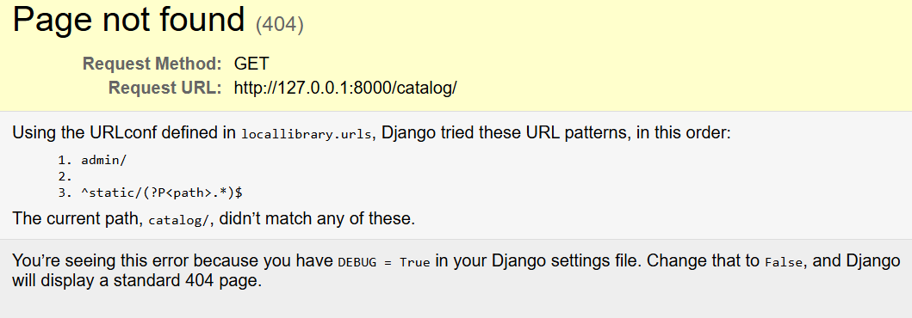
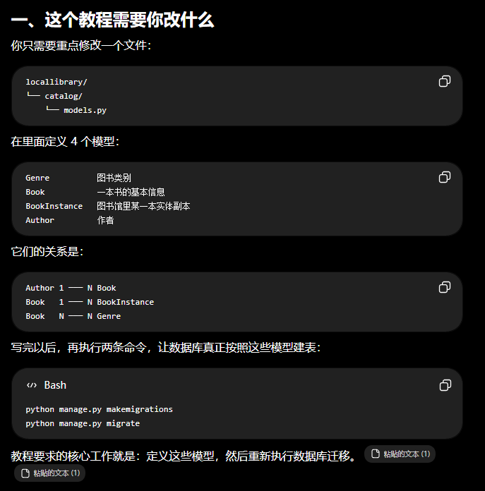
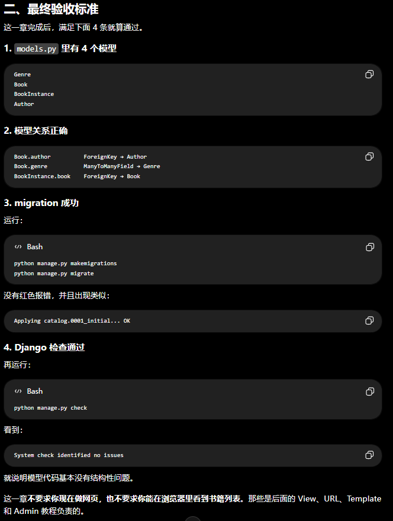
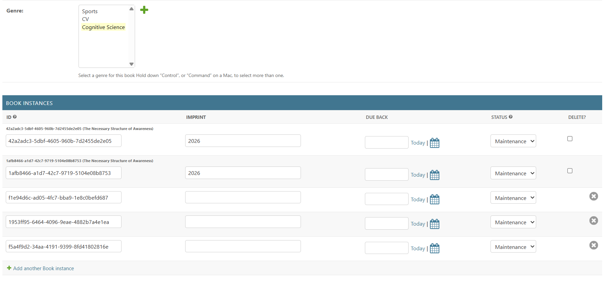

# Iteration-01

## Observations

Django环境已经配好

## Decision

完成P2 创建网站地基

## More Observations

我现在走完了P2的流程，但是我完全不知道我都干了啥，我需要CodeX总结一下今天我完成了什么地基工作以及具体的变更都有什么意义，我完全没概念

## Change & Deliverable 

（分店阐述，精简易懂，绝对不要长篇大论）

今日完成的工作：创建了一个能启动，能连接数据库，知道以后吧“图书功能”放在那里的网站空架子

具体工作
1. 创建Django项目：生成了manage.py、settings.py、总路由等网站基础设施
2. 创建了catalog应用：给图书业务准备了模型、后页面、台、和测试文件
3. 注册catalog：在`INSTALLED_APPS`中告诉Django 这个网站包含catalog功能，请在启动和操作数据库时加载它
4. 配置数据库：使用SQLite，通过迁移创建用户，权限，后台等基础数据表
5. 配置访问根目录时候的路由：
```text
访问 /
   ↓
跳转到 /catalog/
   ↓
交给 catalog/urls.py 处理
```
6. 设置上海时区
7. 启动了开发服务器测试，证明了Django网站骨架能够运行。

## REVIEW



地基已经完成，但房间里还是空的：
- catalog/models.py 还没有图书数据结构
- catalog/views.py 还没有页面逻辑
- catalog/urls.py 还没有具体网址
- 还没有 HTML 页面
所以访问 /catalog/ 出现 404 是正常的。不是网站坏了，而是你已经把路接到了 catalog，但还没有在终点建页面。


## Questions Answer

1. 目前项目文件架构以及每个部分的角色?

Answer:
```text
Local_Library_thn/          ← Git 仓库：保存整个项目
└── locallibrary/           ← 网站运行目录
    ├── manage.py           ← Django 操作入口
    ├── db.sqlite3          ← 数据库文件
    ├── locallibrary/       ← 整个网站的全局配置
    │   ├── settings.py
    │   └── urls.py
    └── catalog/            ← “图书目录”应用
        ├── models.py
        ├── views.py
        └── urls.py
```

2. 什么是应用？

Django 的“应用”不是手机 App，也不是一个独立网站。
它是网站中的一个功能模块。

例如你的图书馆网站以后可以拆成：
- catalog：管理图书、作者、藏书
- accounts：用户登录和账户
- loans：借书、还书
- notifications：到期提醒

整个网站叫 Django 项目（project），里面每个功能区叫 Django 应用（app）。

可以这样理解：
    locallibrary 是整栋图书馆，catalog 是其中的图书管理部门。

Django 自带的后台、用户认证、会话管理，其实也都是已经写好的应用。

Iteration-01 done. 2026-07-29

---

# Iteration-02

## Decision

继续推进，完成P3

## New Observations

教程有点乱，硬读有点烦人

## New Decison

1. 确认在P3中我到底要干啥
2. 确认验收标准

## Deliverable

P3到底要干啥


P3验收标准


Iteration-02 done.

---

# Iteration-03

## Observations

已将教程交给GPT整理并给出逐步执行步骤

## Decision

逐步跟着执行

## Change & Deliverable

写出来catalog/model.py，定义了四个主要数据结构：
1. Book
2. Genre
3. BookInstance
4. Author

已按照如下步骤进行数据模型迁移，建表，和检查。

```sh
python manage.py makemigrations
python manage.py migrate
python manage.py check
```

## Notes

genre 在 Book 里，代码上看起来像一个字段；但在数据库的物理结构里，它不是 Book 表里的一格，也不是直接塞进去一个 Genre，它是一个关系管理器

Iteration-03 done. 2026-07-29

---

# Iteration-04

## Observations

看起来P4教程质量还可以

## Decision

先和P4跟着做试试，可以就走完，不可以再说

## Change & Deliverable

修改的文件：
1. `catalog/admin.py`：注册并配置 Author、Genre、Book、BookInstance 的后台管理页面
2. `catalog/models.py`：新增 `display_genre()`，让后台图书列表可以显示类型
3. `db.sqlite3`：后台操作产生了数据库更新

增加的功能：
1. 四个图书馆模型现在都能在 Django Admin 中管理
2. 作者列表可显示姓名及出生、死亡日期，编辑表单也调整了字段布局
3. 图书列表可显示书名、作者及最多 3 个类型
4. 藏书副本列表可按状态和归还日期筛选
5. 修改了BookInstance的展示，把基本信息和availablity分字段展示，更直观
6. 增加 BookInstance 内联编辑（可以直接在Book页面管理BookInstance），让 Book 编辑页可以直接查看、新增和修改其馆藏实例

Iteration-04 done. 2026-07-30

---

# Iteration-05

## Observations



在BookAdmin页面下，当前虽然设置了bookinstance的内联编辑，但是会显示不是这个book的bookinstance

## Decision

让内联编辑只显示对应的Book的instance

## New Observations

这个后三行只是尚未保存的空白新增表单而已

因此，Django inline 本来就只查询当前 Book 的已有实例；真正需要解决的是隐藏默认的三行空白表单：

```python
class BooksInstanceInline(admin.TabularInline):
    model = BookInstance
    extra = 0
```

## Change & Deliverable

修改的文件：
1. `catalog/admin.py`：将 `BooksInstanceInline.extra` 设置为 `0`
2. `catalog/tests.py`：增加 BookAdmin 内联实例范围测试

增加的功能：
1. Book 编辑页只显示已经属于当前 Book 的 BookInstance
2. 不再默认显示 3 个容易被误认为已有实例的空白新增表单
3. 仍然可以通过 “Add another Book instance” 按需新增实例
4. 自动测试会检查其他 Book 的实例不会出现在当前 Book 的编辑页

Iteration-05 done. 2026-07-30

---